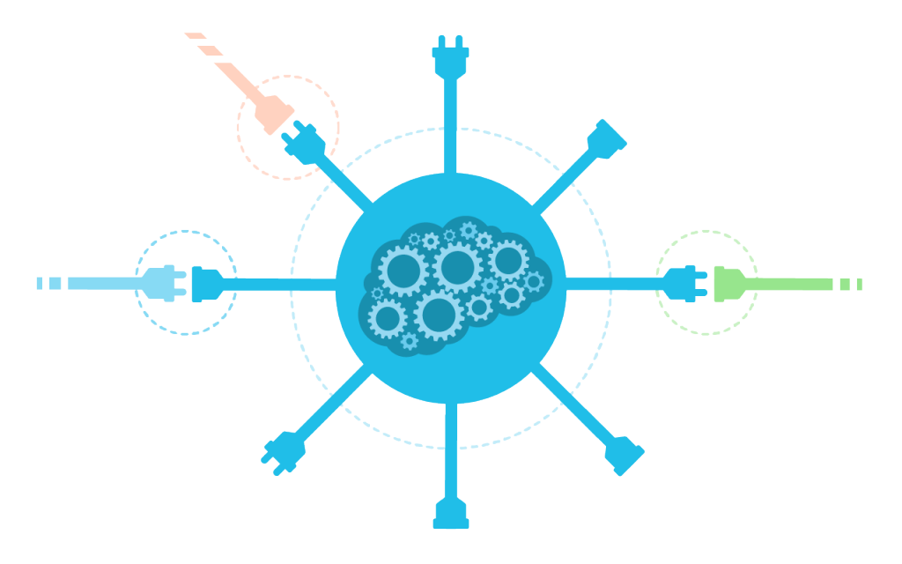
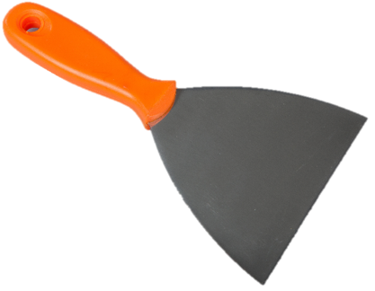

```{r setup, include=FALSE}
knitr::opts_chunk$set(echo = FALSE)
```

# Comentários iniciais

## Comentários iniciais {.flexbox .vcenter}

<center>
```{r echo=FALSE, out.height = '170px'}

knitr::include_graphics("images/white_space.png")

knitr::include_graphics("images/white_space.png")
knitr::include_graphics("images/RStudio.png")
knitr::include_graphics("images/white_space.png")
knitr::include_graphics("images/Octocat.png")
```  
</center>

## Repositório  {.flexbox .vcenter}

<center>
```{r echo=FALSE, fig.cap="augustofadel/web-scraping-smi2018", out.width = '10%'}
knitr::include_graphics("images/githubicon.svg")
```
</center>

<br><br>

- Slides
- Scripts
- Informações adicionais

# Web Scraping

## Web Scraping  {.flexbox .vcenter}

<center>

```{r echo=FALSE, out.width = '50%'}
knitr::include_graphics("images/qmark.png")
```

</center>

## Web Data

- Download
- APIs (Application Programming Interfaces)
- **Web scraping**
- Crawler

<center>

```{r echo=FALSE, out.height = '250px'}
knitr::include_graphics("images/structured_data.png")
knitr::include_graphics("images/white_space.png")
knitr::include_graphics("images/unstructured_data_3.png")
```

</center>

## Web Data {.flexbox .vcenter}

<center>

```{r echo=FALSE, out.height = '200px'}
knitr::include_graphics("images/R.png")
knitr::include_graphics("images/python.png")
knitr::include_graphics("images/selenium.png")
```

</center>

## Download {.flexbox .vcenter}

<center>

```{r echo=FALSE, out.width = '400px'}
knitr::include_graphics("images/download.png")
```

Série histórica do levantamento de preços e de margens de comercialização de combustíveis: [anp.gov.br](http://www.anp.gov.br/precos-e-defesa/234-precos/levantamento-de-precos/868-serie-historica-do-levantamento-de-precos-e-de-margens-de-comercializacao-de-combustiveis)

</center>

## APIs {.flexbox .vcenter}

<center>

```{r echo=FALSE, out.width = '500px'}

```

</center>

## APIs {.flexbox .vcenter}

<center>

```{r echo=FALSE, out.width = '500px'}
knitr::include_graphics("images/cards.png")
```

The Star Wars API: [swapi.co](https://swapi.co/)  
<br>
Best Buy Developer API: [BBYOpen](https://bestbuyapis.github.io/api-documentation/#overview)

</center>

## Web Scraping {.flexbox .vcenter}

<center>

```{r echo=FALSE, out.width = '300px'}

```

Amazon: [amazon.com.br](https://www.amazon.com.br/)  
<br>
Supermercado Pão de Açúcar: [paodeacucar.com](https://www.paodeacucar.com/)  
<br>
GOL Linhas Aéreas: [voegol.com.br](https://voegol.com.br/pt)

</center>

## Obrigado {.flexbox .vcenter}

<center>

### **Augusto Fadel**  
###### DPE/CEEC/GCAD  
<br>
```{r echo=FALSE, out.width = "30px"}

```
+55 21 2142-0452  
<br>
```{r echo=FALSE, out.width = "30px"}
knitr::include_graphics("images/mail.png")
```
augustofadel@gmail.com  
<br>

[](https://github.com/augustofadel)
[](www.linkedin.com/in/augustofadel)  


</center>