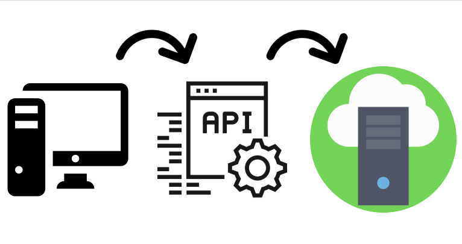

```{r setup, include=FALSE}
knitr::opts_chunk$set(echo = FALSE)
```

## parte I

- R e RStudio  
<br>
- Web data e web scraping  
<br>
- Coleta de dados na web  
    + download  
    + API  
    + web scraping  

## sugestões

- Repositório no github: [web-scraping-smi2018](https://github.com/augustofadel/web-scraping-smi2018)

- IDE: [RStudio](https://www.rstudio.com/)  
  
- Pacotes: [tidyverse](https://www.tidyverse.org/) | [rvest](https://github.com/hadley/rvest) | [httr](https://github.com/r-lib/httr) | [xml2](https://github.com/r-lib/xml2) | [jsonlite](https://github.com/jeroen/jsonlite#jsonlite) | [DBI](https://db.rstudio.com/dbi/)   
  
- Outros recursos:  
    + [R for Data Science](https://r4ds.had.co.nz/)  
    + [Happy Git and GitHub for the useR](http://happygitwithr.com/)  
    + [rstudio::conf 2018](https://www.rstudio.com/resources/videos/rstudioconf-2018-talks/) | [webinars](https://resources.rstudio.com/webinars) | [cheat sheets](https://www.rstudio.com/resources/cheatsheets/)  
    + [DataCamp](https://www.datacamp.com/) | [edX](https://www.edx.org/) | [Cousera](https://www.coursera.org/) | [Udacity](https://br.udacity.com/)  
    + [Stackoverflow](https://stackoverflow.com/)  
    

# Web Scraping

## web scraping  {.flexbox .vcenter}

<center>

```{r echo=FALSE, out.width = '50%'}
knitr::include_graphics("images/qmark.png")
```

</center>

## web data

- Download
- APIs (Application Programming Interfaces)
- Web scraping
- Crawler

<div class="columns-2" class="centered">
```{r echo=FALSE, out.height = '250px'}

```
  
```{r echo=FALSE, out.height = '250px'}
knitr::include_graphics("images/unstructured_data_3.PNG")
```
</div>

## web data {.flexbox .vcenter}

```{r echo=FALSE, out.height = '200px'}
knitr::include_graphics("images/R.png")
knitr::include_graphics("images/python.png")
knitr::include_graphics("images/selenium.png")
```

# Download

## tipos de arquivos

### tipos de arquivos  

- csv (comma-separated values)
- tsv (tab-separated values)
- MS Excel (xls, xlsx)
- zip
- [JSON](https://json.org/example.html) (JavaScript Object Notation)
- [XML](https://www.w3.org/XML/) (Extensible Markup Language)

## download {.flexbox .vcenter}

```{r echo=FALSE, out.width = '300px'}

```

Portal Brasileiro de Dados Abertos: [dados.gov.br](http://dados.gov.br/dataset)  
<br>
Preços de comercialização de combustíveis: [anp.gov.br](http://www.anp.gov.br/precos-e-defesa/234-precos/levantamento-de-precos/868-serie-historica-do-levantamento-de-precos-e-de-margens-de-comercializacao-de-combustiveis)  
<br>
IPCA: [ftp.ibge.gov.br](ftp://ftp.ibge.gov.br/Precos_Indices_de_Precos_ao_Consumidor/IPCA/)

# APIs

## APIs {.flexbox .vcenter}

```{r echo=FALSE, out.width = '800px'}

```

## APIs {.flexbox .vcenter}

```{r echo=FALSE, out.width = '800px'}

```

## APIs {.flexbox .vcenter}

```{r echo=FALSE, out.width = '800px'}

```

## APIs

### HTTP requests  
  
- **GET**  
- POST  
- DELETE  
- HEAD  
- [outros](https://www.w3.org/Protocols/rfc2616/rfc2616-sec5.html)

## APIs

### Respostas  
  
- **200**: sucesso!  
- **300**: redirecionamento  
- 400: erro de cliente  
- 500: erro de servidor  

<br><center>  

[Códigos de resposta HTTP](https://www.w3.org/Protocols/rfc2616/rfc2616-sec10.html)

</center>  

## APIs {.flexbox .vcenter}

```{r echo=FALSE, out.width = '500px'}

```

The Star Wars API: [swapi.co](https://swapi.co/) (pacote [rwars](https://cran.r-project.org/web/packages/rwars/index.html))  
<br>
Sistema IBGE de Recuperação Automática: [SIDRA](http://api.sidra.ibge.gov.br/)  
<br>
Banco Central do Brasil: [Portal de Dados Abertos](https://dadosabertos.bcb.gov.br/)

# Web Scraping

## web scraping

### Estrutura HTML ([tags](https://html.com/tags/))  

- título: `<title> ... </title>`  
- parágrafo de texto: `<p> ... </p>`  
- blocos: `<div> ... </div>`
- tabela: `<table> ... </table>`  
- hiperlink (âncora): `<a> ... </a>`

<br><center>  

`<a href="http://www.ibge.gov.br/">IBGE</a>`

</center>  

## web scraping
  
### Extrair com [`rvest`](https://www.rdocumentation.org/packages/rvest/versions/0.3.2/topics/html_text):  
- `html_name()`  
- `html_attr()`  
- `html_text()`  
- `html_table()`  

<br><center>  

`<a href="http://www.ibge.gov.br/">IBGE</a>`

</center>  

## web scraping {.flexbox .vcenter}

```{r echo=FALSE, out.width = '300px'}
knitr::include_graphics("images/rvest.jpg")
```

<br>
Amazon: [amazon.com.br](https://www.amazon.com.br/)  

## web scraping

### Selenium
- Selenium 2: [WebDriver](http://www.seleniumhq.org/projects/webdriver/)  
- [Standalone server](http://selenium-release.storage.googleapis.com/index.html) ([v3.9.1](http://selenium-release.storage.googleapis.com/3.9/selenium-server-standalone-3.9.1.jar))  
- Pacote [RSelenium](https://github.com/ropensci/RSelenium)  

### Executar o servidor
- Usando [Docker](http://ropensci.github.io/RSelenium/articles/docker.html)
- Usando `RSelenium::rsDriver()`  
- Manualmente

## web scraping

### Funções [RSelenium](https://cran.r-project.org/web/packages/RSelenium/RSelenium.pdf):  
- `navigate()`
- `goBack`  
- `goForward()`  
- `refresh()`  
- `findElement()`  
- `highlightElement()`  
- `clickElement()`  
- `mouseMoveToLocation()`  
- `click()`  
- `sendKeysToElement()`  

## web scraping {.flexbox .vcenter}

```{r echo=FALSE, out.width = '300px'}
knitr::include_graphics("images/selenium.png")
```

<br>
GOL Linhas Aéreas: [voegol.com.br](https://voegol.com.br/pt)

# Boas práticas

## boas práticas

- Verificar e **respeitar** o [`robot.txt`](https://en.wikipedia.org/robots.txt).
- Identificação.  
- Usar `httr::user_agent()` com e-mail de contato.  
- Respeitar o limite de solicitações (rate-limiting).  
- Se não houver limite explícito, usar o bom senso.
- Regra geral: intervalo de um segundo entre solicitações, usar `Sys.sleep(1)`.
- Priorizar horários de menor tráfego.

# Obrigado!

## obrigado {.flexbox .vcenter}

### **Augusto Fadel**  
###### DPE/CEEC/GCAD  

<br>
<br>
```{r echo=FALSE, out.width = "32px"}

```
21 2142-0452  
<br>
```{r echo=FALSE, out.width = "32px"}
knitr::include_graphics("images/mail.png")
```
augusto.fadel@ibge.gov.br  
<br>
```{r echo=FALSE, out.width = "32px"}

```
augustofadel  
